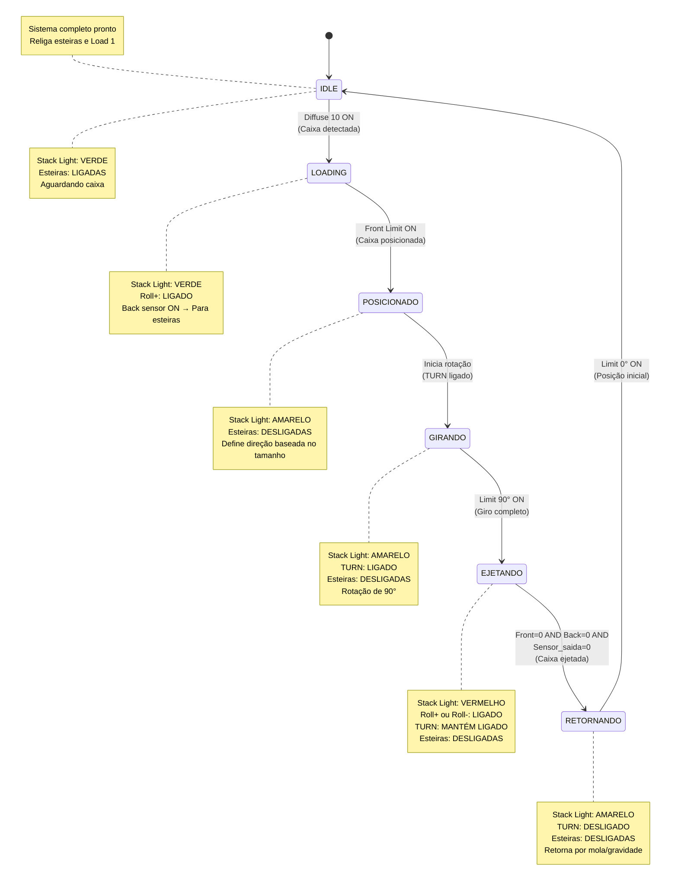

# Diagrama de Máquina de Estados - Turntable System

## Legenda de Sensores

### Entradas (Inputs):
- **Diffuse 10** (Input 12): Detecta caixa chegando no turntable
- **Turntable Front** (Input 29): Caixa posicionada na frente
- **Turntable Back** (Input 28): Caixa no turntable
- **Limit 0°** (Input 26): Posição inicial (0°)
- **Limit 90°** (Input 27): Posição de ejeção (90°)
- **Diffuse 11** (Input 13): Caixa saindo para ESQUERDA
- **Diffuse 12** (Input 14): Caixa saindo para DIREITA

### Saídas (Coils):
- **TURN** (Coil 26): Rotaciona turntable
- **Roll +** (Coil 27): Puxa/empurra para DIREITA
- **Roll -** (Coil 28): Puxa/empurra para ESQUERDA
- **Stack Light Red** (Coil 17): Luz vermelha
- **Stack Light Green** (Coil 18): Luz verde
- **Stack Light Yellow** (Coil 19): Luz amarela

## Lógica de Separação

- **Caixa tamanho 1** → DIREITA (Roll+, Sensor D12)
- **Caixa outros tamanhos** → ESQUERDA (Roll-, Sensor D11)

## Controle de Esteiras

As esteiras (Roller 6M 1, Conveyor 1, Conveyor 2) e Load 1:
- **LIGADAS**: Apenas no estado IDLE
- **DESLIGADAS**: Desde que Back sensor é acionado até voltar ao IDLE
- **Gatilho de parada**: Back sensor (caixa subiu no turntable)
- **Gatilho de religamento**: Limit 0° alcançado (turntable pronto)
